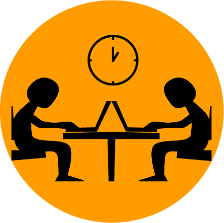

# What is Hacky Hour?

Hacky Hour is an informal meeting for staff and students who need to use data intensive computing in their research. Its intended to get researchers helping each other to make more effective use of research computing. 

## Help with Research Computing

Come along with your questions about how to use computing more effectively in your research or offer to help others with their questions. 

Topics for discussion could include, but aren't limited to:

* Programming
* High Performance Computing
* How to organise and store your data
* Dealing with "big data"
* Help using the Linux command line
* Machine learning
* Data visualisation

## Lightning Talks

You can also present your research in a short 5 minute lightning talk. These talks should be aimed at a broad audience that includes people outside of your own discipline.

If you want to give a talk then please signup by filling out this [form](https://goo.gl/forms/QlOQNKmfJCo2O2hw1)

### Previous Talks

A list of previous talks can be found on the [previous talks](previoustalks) page. 

## Where and when do you meet?

* Friday September 6th, 3:10pm, 0.30 IBERS building
* Friday September 20th, 3:10pm, 3.05 Physics building
* Friday October 4th, 3:10pm, 3.05 Physics building

## What should I bring?

Bring your laptop and your research computing questions or just come along to talk with and help others.

## Who is it for?

Staff or students from any department using computing in their research. 

## Who is running this?

This event is being run by Colin Sauze (cos@aber.ac.uk) who works as a Research Software Engineer for the Super Computing Wales project (http://supercomputing.wales). 

## Is there a Facebook or Twitter page for this?

Yes, there is a [Facebook](https://www.facebook.com/hackyhouraber) page and a [Twitter](https://www.twitter.com/hackyhouraber) account.

## Directory of Expertise

Looking for somebody to help with something, but don't know who to ask? The [directory of expertise](https://board.net/p/HackyHourAber) has a list of people who might be able to help.

If you are willing to offer help to others, then please add yourself to this. Simply copy and paste the template at the bottom of the document and fill out your details. 

## Related Activities

* [Python Study Group](https://scw-aberystwyth.github.io/Python-Study-Group/) - This group meets on alternate weeks to Hacky Hour and is intended for anyone who has basic Python knowledge but wants to improve their Python skills.
* [Super Computing Wales and Software Carpentry Training Courses](http://tinyurl.com/scwworkshops) - These cover the Unix shell, version control with Git, Python programming, HPC usage and parallel processing. 
